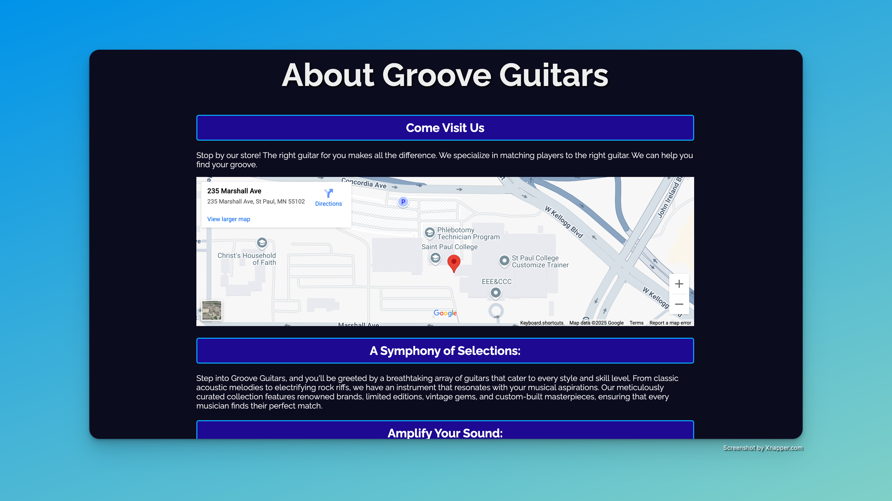
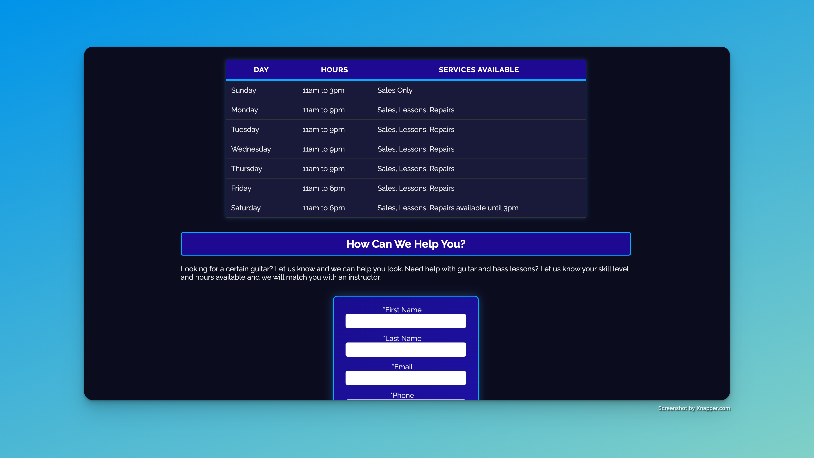

# grooveguitars

🎸 **Groove Guitars Website**

This project was built for Lab 7 and 8, creating a multi-page site with a homepage, about page, and grooves page. It features a styled table and contact form, focusing on HTML, CSS, form handling, and layout design.

## 📚 About

Groove Guitars is a fictional guitar shop website designed to practice:

- Semantic HTML structure
- CSS styling and layout
- Table creation and styling
- Contact form with validation
- Responsive hero image and navigation
- Incremental design improvements over Labs 7–8

## 💻 Features

- Home, About, and Grooves pages
- Hours of Operation table
- Contact form with required fields
- Custom logo, hero image, and navigation bar
- Responsive and accessible design

## 🚀 Skills Practiced

- HTML5 best practices
- CSS selectors, box model, and typography
- Form design and validation
- Responsive page layout
- Design iteration and refinement

## 📸 Screenshots

### 🏠 Home Page

### 📄 About Page

### 🎵 Grooves Page

### 📋 Tables & Forms Page

## 📂 Project Structure

